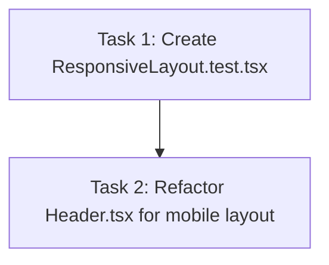

# Plan 3.1: Responsive Test Infrastructure and Header Stack

Decompose Phase 3 (agenda-display-responsiveness) Wave 1 tasks to implement viewport checking and apply responsive classes to the dashboard's Header navigation shell, while establishing automated unit test coverage.

## Dependency Graph

## Tasks

<task type="auto">
  <name>Create Responsive Layout Unit Tests</name>
  <files>
    - frontend-display/src/components/ResponsiveLayout.test.tsx
  </files>
  <action>
    Create a new React Testing Library test file named ResponsiveLayout.test.tsx. It must mock the global window.innerWidth properties and event dispatching to simulate mobile (e.g., width 400px) and desktop (e.g., width 1024px) viewports. Write test assertions checking that Header elements stack vertically, weather and video embed classes become hidden on mobile breakpoints, and manual week cycle controls are present on mobile viewports. Make sure not to duplicate tests from App.test.tsx. Use standard jest.mock for framer-motion as detailed in 03-PATTERNS.md.
  </action>
  <verify>
    Run the Jest test runner inside the docker environment:
    docker run --rm -e CI=true -v "c:/Users/yudhiar/Downloads/oprek/Dev/tv/frontend-display:/app" -w /app node:20-alpine npm test -- src/components/ResponsiveLayout.test.tsx
  </verify>
  <done>
    - ResponsiveLayout.test.tsx is successfully created.
    - Test suites compile and tests run successfully.
  </done>
</task>

<task type="auto">
  <name>Refactor Header Component for Stacking and Clock Adjustments</name>
  <files>
    - frontend-display/src/components/Header.tsx
  </files>
  <action>
    Refactor Header.tsx to apply responsive Tailwind CSS classes per decision D-03. The header wrapper must use flex-col on mobile and flex-row under Tailwind's md breakpoint (768px), adjusting padding from px-12 py-8 on desktop to px-6 py-4 on mobile viewports. The logo element (Setneg Logo) and organization labels must stack vertically and align center on mobile, scaling down titles slightly (text-lg md:text-xl). The digital clock must center on mobile, decrease clock font-size to text-4xl (from text-6xl on desktop), and decrease the date label font-size (text-[10px] md:text-sm).
  </action>
  <verify>
    Run the newly created unit tests to ensure that the header element matches mobile styles when simulated screen width is under 768px:
    docker run --rm -e CI=true -v "c:/Users/yudhiar/Downloads/oprek/Dev/tv/frontend-display:/app" -w /app node:20-alpine npm test -- src/components/ResponsiveLayout.test.tsx
  </verify>
  <done>
    - Header.tsx uses responsive layouts that stack vertically below 768px.
    - Clock font size is text-4xl on mobile viewport sizes (D-03).
    - Unit tests pass.
  </done>
</task>
