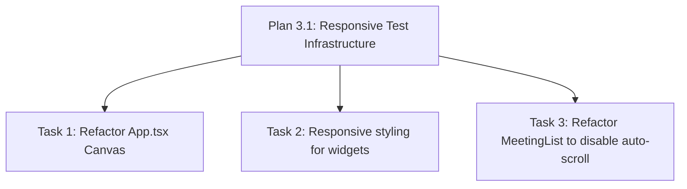

# Plan 3.2: Dashboard Main Canvas and Widgets Responsiveness

Decompose Phase 3 (agenda-display-responsiveness) Wave 2 tasks to refactor the main public TV dashboard route (`/`) layout and all of its individual child widgets.

## Dependency Graph

## Tasks

<task type="auto">
  <name>Refactor App Canvas Layout</name>
  <files>
    - frontend-display/src/App.tsx
  </files>
  <action>
    Modify App.tsx to make the main layout shell mobile-responsive. The top-level wrapper div must be changed from h-screen overflow-hidden to min-h-screen overflow-y-auto md:h-screen md:overflow-hidden to prevent layout clipping and allow natural vertical scrolling on small viewports (Pitfall 1). The main grid container must switch to flex-col on mobile and grid/cols on desktop (flex flex-col gap-6 md:grid md:grid-cols-12 md:grid-rows-6 md:gap-8 md:overflow-hidden). The padding top of the main container must be increased to pt-48 on mobile (compared to pt-36 on desktop) to clear the stacked header.
  </action>
  <verify>
    Run the unit tests to assert class updates:
    docker run --rm -e CI=true -v "c:/Users/yudhiar/Downloads/oprek/Dev/tv/frontend-display:/app" -w /app node:20-alpine npm test -- src/components/ResponsiveLayout.test.tsx
  </verify>
  <done>
    - App.tsx top-level container has overflow-y-auto and min-h-screen on mobile viewports.
    - App.tsx main element stacks children vertically on screen sizes under 768px.
  </done>
</task>

<task type="auto">
  <name>Refactor Video, Weather, and Prayer Times Widgets</name>
  <files>
    - frontend-display/src/components/VideoEmbed.tsx
    - frontend-display/src/components/HourlyWeather.tsx
    - frontend-display/src/components/PrayerTimes.tsx
  </files>
  <action>
    Add Tailwind's hidden md:flex or hidden md:block conditional styling classes to VideoEmbed.tsx and HourlyWeather.tsx top-level sections so they are hidden on mobile viewports under 768px (MOB-02, D-01). Modify PrayerTimes.tsx to stack its header and times vertically on mobile (flex-col items-center gap-4 border-b pb-3 md:flex-row md:items-start md:border-r md:pb-0 md:pr-4 md:border-b-0), and wrap the prayer times list to prevent overflow (flex-wrap justify-center sm:justify-around gap-2 sm:gap-4 md:gap-2).
  </action>
  <verify>
    Run the unit tests to assert element visibility and CSS classes:
    docker run --rm -e CI=true -v "c:/Users/yudhiar/Downloads/oprek/Dev/tv/frontend-display:/app" -w /app node:20-alpine npm test -- src/components/ResponsiveLayout.test.tsx
  </verify>
  <done>
    - VideoEmbed and HourlyWeather are hidden on screen sizes under 768px (MOB-02).
    - PrayerTimes stacks vertically and wraps its time items under 768px (MOB-03).
  </done>
</task>

<task type="auto">
  <name>Disable MeetingList Auto-Scroll and List Duplication on Mobile</name>
  <files>
    - frontend-display/src/components/MeetingList.tsx
  </files>
  <action>
    Update MeetingList.tsx to prevent scroll animation bugs and duplication on mobile viewports. Implement the standard window resize listener state (isMobile) as detailed in 03-PATTERNS.md. Add an early return condition inside the useAnimationFrame loop (if (isMobile) return) so that the translation updates and pauses do not execute on mobile viewports. Change the displayedMeetings definition to only duplicate meetings when both needsScroll is true AND isMobile is false (needsScroll &amp;&amp; !isMobile). Refactor the top-level section container classes to use h-auto md:h-full overflow-visible md:overflow-hidden to allow natural flow.
  </action>
  <verify>
    Run the unit tests to confirm auto-scroll is bypassed and list is not duplicated on mobile widths:
    docker run --rm -e CI=true -v "c:/Users/yudhiar/Downloads/oprek/Dev/tv/frontend-display:/app" -w /app node:20-alpine npm test -- src/components/ResponsiveLayout.test.tsx
  </verify>
  <done>
    - MeetingList has a resize listener tracking mobile viewport state.
    - useAnimationFrame is bypassed on mobile screens.
    - displayedMeetings does not duplicate list entries when simulated screen width is under 768px.
    - Section height is set to h-auto and overflow-visible on mobile.
  </done>
</task>
