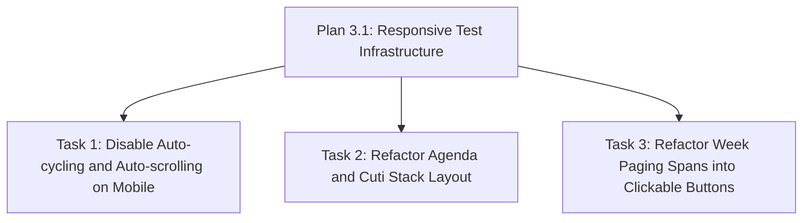

# Plan 3.3: Weekly Calendar and Cuti Dashboard Responsiveness

Decompose Phase 3 (agenda-display-responsiveness) Wave 2 tasks to implement responsiveness, layout stacking, compact typography, and manual week cycle interactions in the public TV Agenda component (`/agenda`).

## Dependency Graph

## Tasks

<task type="auto">
  <name>Disable Auto-cycling and Auto-scrolling on Mobile Viewports</name>
  <files>
    - frontend-display/src/components/AgendaDashboard.tsx
  </files>
  <action>
    Add a window resize listener and isMobile state to AgendaDashboard.tsx. Wrap the 15-second week auto-cycling useEffect timer with a check (if (isMobile) return) so that auto-cycling is disabled on mobile viewports (D-08). Similarly, wrap the Cuti list auto-scroll useEffect block with a check (if (isMobile) return) to disable the high-speed scrolling animation on mobile screens (D-09). Ensure that these timers clear up correctly on component unmount.
  </action>
  <verify>
    Run the unit tests to assert that timers are disabled and activeWeek is controllable on mobile:
    docker run --rm -e CI=true -v "c:/Users/yudhiar/Downloads/oprek/Dev/tv/frontend-display:/app" -w /app node:20-alpine npm test -- src/components/ResponsiveLayout.test.tsx
  </verify>
  <done>
    - AgendaDashboard uses the isMobile viewport width detection.
    - 15-second week auto-cycling interval is skipped on screen widths under 768px.
    - 25 FPS Cuti auto-scrolling interval is skipped on screen widths under 768px.
  </done>
</task>

<task type="auto">
  <name>Refactor Agenda and Cuti Stack Layout and Typography</name>
  <files>
    - frontend-display/src/components/AgendaDashboard.tsx
  </files>
  <action>
    Refactor the main layout of AgendaDashboard.tsx. Change the outer container layout to allow page-level vertical scrolling on mobile (min-h-screen overflow-y-auto md:h-screen md:overflow-hidden) and increase main padding top to pt-48. Convert the main grid container to a stacked flex container on mobile (flex flex-col gap-6 md:grid md:grid-cols-12 md:grid-rows-6 md:gap-8). Order the child columns so that the Weekly Agenda is first (order-1) and Cuti Pegawai is second (order-2) per D-06. Refactor the sliding week viewport div to use relative/static flex layouts instead of grid absolute layouts on mobile (flex flex-col gap-6 w-full h-auto md:grid md:grid-cols-5 md:h-full md:absolute md:inset-0) to prevent clipping (D-04). Apply compact padding and sizing to event cards (p-4 instead of p-5, title text-sm instead of text-base) per D-05, and style the Cuti list container as a static vertical stack without internal nested scrollbars (overflow-y-visible md:overflow-y-auto) per D-07. Hide the HourlyWeather widget container on mobile by adding hidden md:block to its parent motion.div wrapper (D-02).
  </action>
  <verify>
    Run the unit tests to verify layout structure, ordering, and compact style classes:
    docker run --rm -e CI=true -v "c:/Users/yudhiar/Downloads/oprek/Dev/tv/frontend-display:/app" -w /app node:20-alpine npm test -- src/components/ResponsiveLayout.test.tsx
  </verify>
  <done>
    - Weekly agenda day columns stack vertically on mobile (D-04).
    - Event cards use compact styling on mobile (D-05).
    - Weekly Agenda stacks above Cuti list on mobile (D-06).
    - Cuti list and day cards have overflow-y-visible on mobile to disable inner scrolling (D-07).
    - HourlyWeather is hidden under 768px on the /agenda route (D-02).
  </done>
</task>

<task type="auto">
  <name>Convert Week Paging Indicators into Clickable Buttons</name>
  <files>
    - frontend-display/src/components/AgendaDashboard.tsx
  </files>
  <action>
    Locate the Active Week Paging Indicators banner inside AgendaDashboard.tsx. Convert the two static span elements (for "Minggu Ini" and "Minggu Depan") into active button elements, adding cursor-pointer hover state classes. Assign onClick event handlers to allow manual switching (onClick={() => setActiveWeek(1)} and onClick={() => setActiveWeek(2)}) to allow users to switch weeks manually when auto-cycling is disabled (D-08).
  </action>
  <verify>
    Run the unit tests to assert that the paging indicators are clickable button elements and trigger activeWeek state changes:
    docker run --rm -e CI=true -v "c:/Users/yudhiar/Downloads/oprek/Dev/tv/frontend-display:/app" -w /app node:20-alpine npm test -- src/components/ResponsiveLayout.test.tsx
  </verify>
  <done>
    - Paging indicators are refactored into button elements.
    - Tapping the buttons updates the activeWeek state to switch views (D-08).
  </done>
</task>
