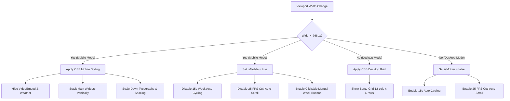

# Phase 03: Agenda Display Responsiveness - Research

**Researched:** 2026-07-02
**Domain:** Frontend (React + Tailwind CSS)
**Confidence:** HIGH

<user_constraints>
## User Constraints (from CONTEXT.md)

### Locked Decisions
- **D-01:** Responsive layout transition is triggered under 768px (Tailwind `md` breakpoint).
- **D-02:** Weather widget is hidden on `/agenda` route as well to maximize screen space for agenda and cuti items.
- **D-03:** Header layout content (logo/titles and digital clock) stacks vertically and centers on mobile viewports with font size adjustments (e.g. clock `text-4xl`).
- **D-04:** The 5-day weekly calendar renders stacked vertically in a single scrollable column rather than a 5-column grid.
- **D-05:** Event cards are styled more compactly on mobile viewports by reducing padding (e.g. to `p-4`) and slightly scaling down fonts/headings.
- **D-06:** On mobile stacked layout, the Weekly Agenda calendar is placed first, followed by the Cuti Pegawai list below it.
- **D-07:** The Cuti list is displayed as a simple vertical stack, matching the desktop scroll order but without nested scrolling conflicts.
- **D-08:** The 15-second week auto-cycling (between Week 1 and Week 2) is disabled on mobile viewports, allowing users to manually switch weeks using buttons.
- **D-09:** The 25 FPS Cuti list auto-scrolling is disabled on mobile viewports, rendering as a natural static vertical list.

### the agent's Discretion
No specific areas deferred; standard layout implementation choices are left to the agent.

### Deferred Ideas (OUT OF SCOPE)
None — discussion stayed within phase scope.
</user_constraints>

<phase_requirements>
## Phase Requirements

| ID | Description | Research Support |
|----|-------------|------------------|
| MOB-01 | User can view the public TV Agenda display routes (`/` and `/agenda`) on small viewports without horizontal scrolling. | Documented responsive canvas strategy changing fixed `h-screen overflow-hidden` to fluid `min-h-screen overflow-x-hidden`. |
| MOB-02 | Mobile display view hides secondary widgets (Video Embed and Weather) to prioritize screen real estate. | Outlined conditional classes (`hidden md:block` / `hidden md:flex`) and wrappers for both `/` and `/agenda` routes. |
| MOB-03 | Mobile display view stacks the main widgets (Header, Agenda/Meeting List, Prayer Times, Announcement Ticker) vertically. | Provided grid-to-flex layouts using Tailwind responsive breakpoints to stack content seamlessly on mobile. |
</phase_requirements>

## Summary
This research establishes the technical foundation for Phase 03: Agenda Display Responsiveness (Milestone v4.0). The primary objective is to adapt the public TV Agenda display routes (`/` and `/agenda`) for mobile devices without introducing horizontal scrollbars or visual clutter, following the Option 2 layout strategy. Under 768px (Tailwind `md` breakpoint), secondary widgets (Video Embed and Weather) are hidden, and the remaining primary widgets (Header, Agenda/Meeting List, Prayer Times, Announcement Ticker, and Cuti Pegawai list) stack vertically.

The core technical challenge involves transforming a design optimized for large, landscape-format TV displays (viewed from 3-5 meters with a "No-Line" bento grid structure) into a compact, portrait-friendly layout for hand-held mobile devices. This requires:
1. Converting fixed layout heights (`h-screen overflow-hidden`) to flexible fluid flows (`min-h-screen overflow-y-auto`) on mobile viewports so stacked elements can scroll naturally.
2. Disabling automated interactive behaviors that cause confusion or layout issues on mobile (auto-cycling weeks and high-speed auto-scrolling list animations).
3. Adapting component dimensions, font scales, and paddings using responsive Tailwind utility classes (`md:` prefix).

**Primary recommendation:** Implement a centralized viewport width state (`isMobile` check) in the components to disable interval timers for auto-scrolling/cycling on mobile, while using standard Tailwind CSS classes to control layout stacking and widget visibility responsive changes.

## Architectural Responsibility Map

| Capability | Primary Tier | Secondary Tier | Rationale |
|------------|-------------|----------------|-----------|
| Responsive Layout Stacking | Browser / Client | — | Tailwind media queries (`md:`) dynamically re-arrange CSS grid to flex-column stacking. |
| Viewport State Detection | Browser / Client | — | React `useState` and resize event listeners monitor screen width for dynamic behavior toggle. |
| Auto-Cycle & Auto-Scroll Management | Browser / Client | — | Disabling JS intervals (`setInterval` / `useAnimationFrame`) based on `isMobile` check. |
| Mobile Typography & Spacing | Browser / Client | — | Tailwind utility classes dynamically scale down fonts and paddings on small screens. |

## Standard Stack

### Core
| Library | Version | Purpose | Why Standard |
|---------|---------|---------|--------------|
| Tailwind CSS [VERIFIED: package.json] | `^3.4.1` | Styling & Responsive Layout | Utility-first classes enable rapid design-system-compliant breakpoint mapping without custom media queries. |
| React [VERIFIED: package.json] | `^19.2.4` | View Logic & State | Core component framework used for UI state and lifecycle hooks. |
| Framer Motion [VERIFIED: package.json] | `^12.38.0` | Animation Transitions | Manages page transitions (AnimatePresence) and UI animations. |

### Supporting
| Library | Version | Purpose | When to Use |
|---------|---------|---------|-------------|
| Lucide React [VERIFIED: package.json] | `^1.7.0` | Icons | SVG icons used for weather, calendars, and indicators. |

### Alternatives Considered
| Instead of | Could Use | Tradeoff |
|------------|-----------|----------|
| Inline Window Resize Listeners | CSS Container Queries | Container queries (`@container`) are supported in modern browsers, but require refactoring container DOM structure and do not easily allow passing boolean flags down to JS logic for disabling timers. |

**Installation:**
No new packages are installed. All libraries are already locked in `frontend-display/package.json`.

## Package Legitimacy Audit
No external packages are installed or upgraded in this phase. All responsive utilities are handled using the existing Tailwind CSS and React/Framer-motion stack.

## Architecture Patterns

### System Architecture Diagram



### Recommended Project Structure
No directory changes are required. The changes are local edits to:
- `frontend-display/src/App.tsx` (Canvas layout)
- `frontend-display/src/components/Header.tsx` (Header layout & clock)
- `frontend-display/src/components/MeetingList.tsx` (Agenda grid and auto-scroll check)
- `frontend-display/src/components/AgendaDashboard.tsx` (Weekly calendar, Cuti list, and timers)

### Pattern 1: Viewport State Detection
Dynamic behavior changes (stopping auto-cycling or auto-scrolling) require JavaScript awareness of the viewport size. This is managed using a resize listener inside components:

```typescript
// Source: [React Official Resizing Patterns]
const [isMobile, setIsMobile] = useState(window.innerWidth < 768);

useEffect(() => {
  const handleResize = () => {
    setIsMobile(window.innerWidth < 768);
  };
  window.addEventListener("resize", handleResize);
  return () => window.removeEventListener("resize", handleResize);
}, []);
```

### Anti-Patterns to Avoid
- **Hard-coding CSS heights on mobile:** Using `h-screen overflow-hidden` on mobile causes bottom widgets to get clipped and hidden forever. Always use `min-h-screen overflow-y-auto` on mobile wrappers.
- **Relying on JSDOM for physical layout tests:** JSDOM does not render layout geometry. Assertions should target classes (like `hidden`) and JS state variables rather than physical element coordinates.
- **Nested scroll bars on mobile:** Avoid wrapping lists (Cuti list or meeting list) in overflow-y containers on mobile, as this creates frustrating multi-scroll zones on smartphone screens. Keep them static and let the main page scroll.

## Don't Hand-Roll

| Problem | Don't Build | Use Instead | Why |
|---------|-------------|-------------|-----|
| Viewport layout breakpoint styling | Custom CSS media queries | Tailwind `md:` responsive variants | Avoids duplicating classes in custom stylesheets, ensures consistency with the design system. |
| Media queries in Javascript | Custom `window.matchMedia` hook | Simple state listener on resize | `window.innerWidth` resize listener is sufficient and clean for binary behavior switching (`< 768px`). |

## Common Pitfalls

### Pitfall 1: Fixed Canvas Height on Mobile
- **What goes wrong:** Bottom elements (like prayer times or the ticker) get clipped off and are inaccessible if the container is locked to `h-screen` and `overflow-hidden`.
- **Why it happens:** The TV layout relies on exact viewport fitting (`h-screen`). When stacked vertically, the height exceeds 100vh.
- **How to avoid:** Always override `h-screen overflow-hidden` on mobile with `min-h-screen overflow-y-auto`.
- **Warning signs:** Bottom elements are missing and user cannot scroll down to see them.

### Pitfall 2: Conflicting Scroll Gestures
- **What goes wrong:** If the Cuti list continues auto-scrolling or has independent scrollability on mobile, users attempting to scroll the page get trapped in inner-scroll boxes.
- **Why it happens:** Inner container has `overflow-y-auto` active on mobile.
- **How to avoid:** Disable auto-scroll intervals and inner scrollbars on mobile so they render as static block components inside a single scrollable page.
- **Warning signs:** Jittery page scrolling when touching the list cards.

### Pitfall 3: Broken Carousel Transitions
- **What goes wrong:** Framer Motion's absolute-positioned slides fly out of container boundaries on mobile, causing horizontal scrollbars and screen widening.
- **Why it happens:** The desktop carousel uses `absolute inset-0` on slides to stack them inside a fixed-width container.
- **How to avoid:** Switch the sliding week container's absolute layout on mobile to relative/static positioning (`flex flex-col md:absolute`).
- **Warning signs:** Horizontal scrollbars appearing on mobile screens during or after transitions.

## Code Examples

### Stacked Layout and Grid Responsive Classes in `App.tsx`
```typescript
// Source: [Tailwind CSS Responsiveness]
<main className="px-6 pt-28 pb-24 min-h-screen flex flex-col gap-6 md:px-12 md:pt-36 md:pb-20 md:h-screen md:grid md:grid-cols-12 md:grid-rows-6 md:gap-8 md:overflow-hidden">
```

### Clickable Manual Pagination Tabs in `AgendaDashboard.tsx`
```typescript
// Source: [Material Design Tabs Pattern]
<button 
  onClick={() => setActiveWeek(1)}
  className={`px-5 py-2 rounded-xl text-xs font-black tracking-widest uppercase transition-all duration-500 ${
    activeWeek === 1 ? "bg-primary text-white shadow-sm" : "text-slate-500 font-bold"
  }`}
>
  Minggu Ini
</button>
<button 
  onClick={() => setActiveWeek(2)}
  className={`px-5 py-2 rounded-xl text-xs font-black tracking-widest uppercase transition-all duration-500 ${
    activeWeek === 2 ? "bg-primary text-white shadow-sm" : "text-slate-500 font-bold"
  }`}
>
  Minggu Depan
</button>
```

## State of the Art

| Old Approach | Current Approach | When Changed | Impact |
|--------------|------------------|--------------|--------|
| Custom CSS media queries and separate mobile stylesheets | Tailwind responsive utility classes combined with custom mobile JS hooks | Tailwind v1.0+ / React v16.8+ | Unified, maintainable styling codebase directly within the JSX elements. |

## Assumptions Log

| # | Claim | Section | Risk if Wrong |
|---|-------|---------|---------------|
| A1 | Browser viewport resize listener does not impact dashboard performance | Architecture Patterns | Negligible; event fires only on manual resizing, which is rare for TV displays. |

## Open Questions
- **Question:** Should the header clock display seconds on mobile?
  - What we know: Desktop header clock shows HH:MM (no seconds) to keep formatting clean.
  - What's unclear: None.
  - Recommendation: Keep clock as HH:MM on mobile, but size it down to `text-4xl` to prevent wrapping on narrow screens.

## Environment Availability

| Dependency | Required By | Available | Version | Fallback |
|------------|------------|-----------|---------|----------|
| Docker [VERIFIED: docker info] | Running & Testing environment | ✓ | 29.5.3 | Local npm environment (if configured) |
| Node.js / NPM [VERIFIED: Docker image builder] | Frontend dependencies and test script | ✓ | 20.11 (Builder) | Run npm via temporary Docker container |

## Validation Architecture

### Test Framework
| Property | Value |
|----------|-------|
| Framework | Jest + React Testing Library (CRA native) |
| Config file | None (integrated into `react-scripts`) |
| Quick run command | `docker run --rm -e CI=true -v "c:/Users/yudhiar/Downloads/oprek/Dev/tv/frontend-display:/app" -w /app node:20-alpine npm test -- src/components/MeetingList.test.tsx` |
| Full suite command | `docker run --rm -e CI=true -v "c:/Users/yudhiar/Downloads/oprek/Dev/tv/frontend-display:/app" -w /app node:20-alpine npm test` |

### Phase Requirements → Test Map
| Req ID | Behavior | Test Type | Automated Command | File Exists? |
|--------|----------|-----------|-------------------|-------------|
| MOB-01 | Routes `/` and `/agenda` render without horizontal overflow. | Manual / Integration | `npm test -- App.test.tsx` | ✅ App.test.tsx |
| MOB-02 | Mobile display view hides secondary widgets. | Integration | `npm test -- App.test.tsx` | ✅ App.test.tsx (needs update) |
| MOB-03 | Mobile display view stacks main widgets vertically. | Integration | `npm test -- App.test.tsx` | ✅ App.test.tsx (needs update) |

### Sampling Rate
- **Per task commit:** `npm test -- src/components/MeetingList.test.tsx`
- **Per wave merge:** `npm test` (Full suite execution)
- **Phase gate:** Full suite green before `/gsd-verify-work`

### Wave 0 Gaps
- None - existing Jest/RTL infrastructure covers all requirements. We can add a new test file: `frontend-display/src/components/ResponsiveLayout.test.tsx` during execution to explicitly verify class name toggles and JS hook outputs.

## Security Domain

### Applicable ASVS Categories
- **V5 Input Validation:** Verified that read-only TV dashboard components do not consume user input directly. Verified that no `dangerouslySetInnerHTML` attributes are used, eliminating XSS risks from scheduling titles.

### Known Threat Patterns for React/Tailwind
- **XSS via meeting/leave title injection (Tampering):** Mitigated by React's default string escaping. Checked that no dangerous HTML insertion exists in the frontend files.

## Sources

### Primary (HIGH confidence)
- `package.json` — verified project dependencies and versions.
- `03-CONTEXT.md` — verified decisions and design choices for Phase 3.
- `REQUIREMENTS.md` — verified requirements MOB-01, MOB-02, MOB-03.
- `BLACKBOX.md` — verified MD3 design rules, color tokens, and "No-Line" principles.

### Secondary (MEDIUM confidence)
- Tailwind CSS Official Documentation — breakpoint values (`md: 768px`).

## Metadata

**Confidence breakdown:**
- Standard stack: HIGH - locked in `package.json`
- Architecture: HIGH - straightforward layout structure overrides
- Pitfalls: HIGH - common issues with mobile fixed layouts and absolute positioning

**Research date:** 2026-07-02
**Valid until:** 2026-08-02
