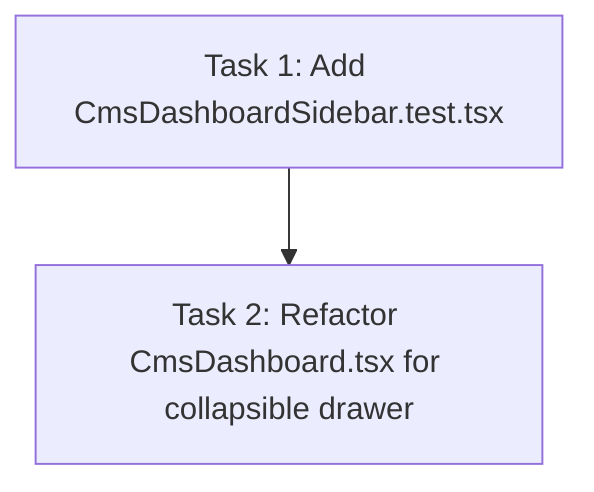

# Plan 4.1: Collapsible Sidebar Drawer Implementation and Verification

Decompose Phase 4 (cms-admin-sidebar-drawer) Wave 1 tasks to implement stateful sidebar drawer toggling on viewports under 1024px, add hamburger and close buttons with custom overlays, and verify behavior with a new test suite.

## Dependency Graph

## Tasks

<task type="auto">
  <name>Create CMS Sidebar Drawer Unit Tests</name>
  <files>
    - frontend-display/src/components/CmsDashboardSidebar.test.tsx
  </files>
  <action>
    Create a new unit test file named CmsDashboardSidebar.test.tsx inside the components directory. Mock the global window.innerWidth properties and event dispatching to simulate mobile/tablet (width 800px) and desktop (width 1200px) viewports. Write test assertions checking that under simulated 800px width:
    1. A hamburger menu button is present and clicking it reveals the sidebar.
    2. A backdrop overlay is visible when the sidebar is open, and clicking it closes the sidebar.
    3. Selecting any navigation link inside the sidebar updates the active tab and closes the sidebar.
    Ensure to mock API fetches and Google client integrations as CmsDashboard does on boot, so the tests render cleanly without actual network calls.
  </action>
  <verify>
    Run the Jest test runner inside the docker environment:
    docker run --rm -e CI=true -v "c:/Users/yudhiar/Downloads/oprek/Dev/tv/frontend-display:/app" -w /app node:20-alpine npm test -- src/components/CmsDashboardSidebar.test.tsx
  </verify>
  <done>
    - CmsDashboardSidebar.test.tsx is successfully created.
    - Test suites compile and run.
  </done>
</task>

<task type="auto">
  <name>Refactor CMS Dashboard sidebar for mobile drawer</name>
  <files>
    - frontend-display/src/components/CmsDashboard.tsx
  </files>
  <action>
    Refactor CmsDashboard.tsx to:
    1. Import `Menu` and `X` from `lucide-react`.
    2. Add `isSidebarOpen` state initialized to `false`.
    3. Add a hamburger button (`lg:hidden`) next to the active tab page title in the main content header that sets `isSidebarOpen` to `true`.
    4. Add a close button (`lg:hidden`) in the sidebar branding section that sets `isSidebarOpen` to `false`.
    5. Wrap the sidebar aside tag with responsive classes to toggle between static layout on desktop (`lg:static lg:translate-x-0`) and fixed overlay on small screens (`fixed inset-y-0 left-0 z-50 w-80 transform transition-transform duration-300 ease-in-out` controlled by `translate-x-0` and `-translate-x-full`).
    6. Render a semi-transparent backdrop overlay (`bg-slate-900/40 backdrop-blur-sm z-40 fixed inset-0 lg:hidden`) when `isSidebarOpen` is true, and close the sidebar upon click.
    7. Update nav links inside the sidebar to set `isSidebarOpen` to `false` when clicked.
  </action>
  <verify>
    Run the unit tests to ensure that the sidebar drawer behaves correctly on simulated widths:
    docker run --rm -e CI=true -v "c:/Users/yudhiar/Downloads/oprek/Dev/tv/frontend-display:/app" -w /app node:20-alpine npm test -- src/components/CmsDashboardSidebar.test.tsx
  </verify>
  <done>
    - Sidebar transitions to collapsible drawer under 1024px.
    - Hamburger button, close button, and backdrop overlay work correctly.
    - Nav links close the drawer.
    - Unit tests pass.
  </done>
</task>
