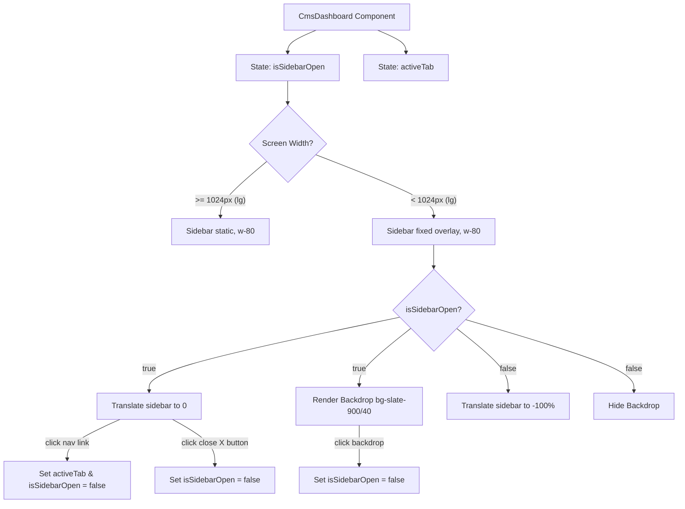

# Phase 4: CMS Admin Sidebar Drawer - Research

**Researched:** 2026-07-02
**Domain:** Frontend (React + Tailwind CSS)
**Confidence:** HIGH

<user_constraints>
## User Constraints (from CONTEXT.md)

### Locked Decisions
- **D-01:** Responsive sidebar drawer layout is triggered under 1024px (Tailwind `lg` breakpoint).
- **D-02:** Hamburger menu toggle button using the `Menu` icon from Lucide React is displayed next to the main content title on screens below 1024px.
- **D-03:** Close button using the `X` icon from Lucide React is displayed in the sidebar's branding header on screens below 1024px.
- **D-04:** Sidebar is styled as `fixed` position on viewports under 1024px, translating off-screen (`-translate-x-full`) by default, and sliding in (`translate-x-0`) with a smooth CSS transition (`transition-transform duration-300 ease-in-out`).
- **D-05:** A semi-transparent backdrop overlay (`bg-slate-900/40 backdrop-blur-sm`) covers the main canvas under 1024px when the sidebar is open.
- **D-06:** Tapping the backdrop overlay or any navigation links inside the sidebar automatically closes the drawer menu (sets `isSidebarOpen` state to `false`).

### the agent's Discretion
- Layout tuning for small viewport title headings and clock padding in the main content header is left to the developer.

### Deferred Ideas (OUT OF SCOPE)
- MOB-10 (Support for horizontal swipe gestures to open/close the CMS Admin drawer menu) is deferred to future releases.
</user_constraints>

<phase_requirements>
## Phase Requirements

| ID | Description | Research Support |
|----|-------------|------------------|
| MOB-04 | User can open and close the CMS Admin sidebar drawer on smartphone viewports using a hamburger menu toggle button. | Defined stateful toggle `isSidebarOpen` in React, rendered in `CmsDashboard.tsx`. |
| MOB-05 | Tapping the backdrop overlay outside the open sidebar drawer closes the sidebar automatically. | Styled clickable backdrop div covering the screen under `lg` breakpoint. |
| MOB-06 | Selecting any sidebar navigation link closes the drawer to reveal the corresponding content panel. | Handled via updated event listeners in navigation buttons to set `isSidebarOpen(false)`. |
</phase_requirements>

## Summary
This research covers the implementation details for the collapsible sidebar drawer menu in the CMS Admin panel (`/admin` / `/cms`). On desktop viewports (1024px and above), the sidebar remains statically displayed on the left side of the dashboard. On mobile and tablet screens (under 1024px), the sidebar transitions into a fixed-position overlay drawer that can be toggled via a hamburger button.

To achieve this cleanly, we:
1. Introduce a React state variable `isSidebarOpen` to track the toggle status of the drawer.
2. Apply Tailwind utility classes to dynamically switch the layout type of the sidebar: `fixed` and translated off-screen on small screens, and `static` on `lg` screens.
3. Import the `Menu` (hamburger) and `X` (close) icons from `lucide-react`.
4. Implement a semi-transparent overlay backdrop that captures click/tap events to close the sidebar.
5. Create a unit test suite to verify the sidebar open/close functionality, backdrop behavior, and link transitions under simulated mobile screen widths.

## Architectural Responsibility Map

| Capability | Primary Tier | Secondary Tier | Rationale |
|------------|-------------|----------------|-----------|
| Responsive Sidebar Layout | Browser / Client | — | Tailwind CSS breakpoint variants (`lg:static` vs `fixed`) automatically update styling. |
| Drawer State Management | Browser / Client | — | React component state (`isSidebarOpen`) controls visibility and classes. |
| Click/Tap Close Event Handling | Browser / Client | — | Inline event handlers trigger state updates on backdrop click and nav button clicks. |

## Standard Stack

### Core
| Library | Version | Purpose | Why Standard |
|---------|---------|---------|--------------|
| Tailwind CSS [VERIFIED] | `^3.4.1` | Styling & Drawer Transitions | Breakpoint utility variants and CSS transition classes. |
| React [VERIFIED] | `^19.2.4` | View Logic & Component State | Manages sidebar toggling and route active tab updates. |

### Supporting
| Library | Version | Purpose | When to Use |
|---------|---------|---------|-------------|
| Lucide React [VERIFIED] | `^1.7.0` | Navigation and Controls Icons | `Menu` and `X` icons represent toggle actions. |

## Architecture Patterns

### System Architecture Diagram



### Recommended Project Structure
No directory changes are required. The changes are local edits to:
- `frontend-display/src/components/CmsDashboard.tsx`
- We will add a new test file: `frontend-display/src/components/CmsDashboardSidebar.test.tsx` to verify these requirements.

### Anti-Patterns to Avoid
- **Uncontrolled layout shifts:** Do not hide the sidebar on mobile by omitting it from the DOM entirely; use CSS translations (`-translate-x-full` to `translate-x-0`) so it slides in smoothly rather than popping into existence.
- **Nested interactive element bugs:** Ensure click propagation is handled correctly on the backdrop and buttons to prevent accidental clicks on background forms.

## Common Pitfalls

### Pitfall 1: No Horizontal Scrollbar Prevention
- **What goes wrong:** If the sidebar does not have proper `z-index` or overlay styling, it can push the main content to the right, introducing a horizontal scrollbar on mobile.
- **How to avoid:** Ensure the sidebar has class `fixed z-50` and is completely detached from the document flow on viewports below `lg` (1024px).

### Pitfall 2: Backdrop Scroll Bleed
- **What goes wrong:** When the sidebar drawer is open, scrolling the page can still scroll the background main content.
- **How to avoid:** While less critical for this simple dashboard, the fixed container size of the app (`h-screen overflow-hidden`) inherently limits body scroll. We just need to make sure the main content block has `overflow-y-auto` which will be covered by the backdrop overlay.

## Code Examples

### Responsive Sidebar Classes
```tsx
<aside className={`
  fixed inset-y-0 left-0 z-50 w-80 bg-white/90 backdrop-blur-xl border-r border-slate-200/50 flex flex-col p-6 h-full transition-transform duration-300 ease-in-out
  lg:static lg:translate-x-0 lg:bg-white/50
  ${isSidebarOpen ? "translate-x-0" : "-translate-x-full"}
`}>
```

## Validation Architecture

### Test Framework
We will run automated unit tests using Jest and React Testing Library via our Docker setup.
Quick run command:
`docker run --rm -e CI=true -v "c:/Users/yudhiar/Downloads/oprek/Dev/tv/frontend-display:/app" -w /app node:20-alpine npm test -- src/components/CmsDashboardSidebar.test.tsx`

### Phase Requirements → Test Map
| Req ID | Behavior | Test Type | Automated Command | File Exists? |
|--------|----------|-----------|-------------------|-------------|
| MOB-04 | User can toggle sidebar drawer via Hamburger and X buttons. | Unit Test | `npm test -- CmsDashboardSidebar.test.tsx` | [NEW] |
| MOB-05 | Click on backdrop closes the sidebar. | Unit Test | `npm test -- CmsDashboardSidebar.test.tsx` | [NEW] |
| MOB-06 | Selecting a sidebar link updates tab and closes drawer. | Unit Test | `npm test -- CmsDashboardSidebar.test.tsx` | [NEW] |

## Metadata

**Confidence:** HIGH
**Research date:** 2026-07-02
**Valid until:** 2026-08-02
