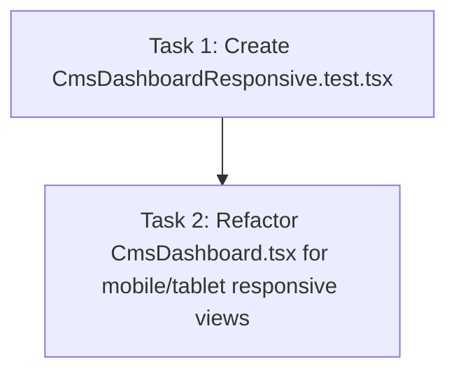

# Plan 5.1: CMS Admin Tables & Forms Responsiveness

Decompose Phase 5 (cms-admin-tables-forms) Wave 1 tasks to implement responsive layout updates for statistics cards, forms, and list displays, and verify behavior with a new test suite.

## Dependency Graph

## Tasks

<task type="auto">
  <name>Create CMS Dashboard Responsiveness Unit Tests</name>
  <files>
    - frontend-display/src/components/CmsDashboardResponsive.test.tsx
  </files>
  <action>
    Create a new unit test file named CmsDashboardResponsive.test.tsx inside the components directory. Mock the global window.innerWidth properties and event dispatching to simulate mobile (width 600px), tablet (width 800px), and desktop (width 1200px) viewports. Write test assertions checking that:
    1. On mobile (< 768px), the statistics cards stack in a single column and tables are replaced by card lists (displaying all vital details and a 44x44px trash button).
    2. On tablet (768px to 1023px), tables are rendered within a container that allows horizontal scroll.
    3. On mobile and tablet (< 1024px), the grid container for Agenda and Cuti stacks the form above the list.
    4. Input fields, autocomplete dropdown items, delete buttons, and sidebar tabs have classes or styles achieving minimum touch targets of 44x44px.
    Ensure to mock API fetches and Google client integrations as CmsDashboard does on boot, so the tests render cleanly without actual network calls.
  </action>
  <verify>
    Run the Jest test runner via cmd:
    cmd /c "set CI=true && C:\nvm4w\nodejs\node.exe node_modules\react-scripts\bin\react-scripts.js test src/components/CmsDashboardResponsive.test.tsx"
  </verify>
  <done>
    - CmsDashboardResponsive.test.tsx is successfully created.
    - Test suite runs and asserts responsive switching and touch target sizing.
  </done>
</task>

<task type="auto">
  <name>Refactor CMS Dashboard elements for responsive views and touch sizing</name>
  <files>
    - frontend-display/src/components/CmsDashboard.tsx
  </files>
  <action>
    Refactor CmsDashboard.tsx to implement:
    1. Responsive main padding (`p-4 md:p-10`) and flexible header layouts.
    2. Vertical stacking for stats cards and instructions (`grid-cols-1 md:grid-cols-2`).
    3. Grid column changes to stack forms and lists vertically below 1024px, placing forms above lists/tables.
    4. Dynamic switching of list displays based on screen size:
       - Viewports >= 1024px: Normal tables.
       - Viewports 768px to 1023px: Tables inside `overflow-x-auto` wrapper.
       - Viewports < 768px: Card list layout showing vital fields (Agenda: Title, Date, Time, Location, Delete; Cuti: Name, Date Range, Month, Delete).
    5. Universal 44x44px minimum sizing for touch targets on inputs, dropdown items, tabs, and action buttons.
  </action>
  <verify>
    Run all Jest test suites to ensure both sidebar drawer and responsiveness tests pass:
    cmd /c "set CI=true && C:\nvm4w\nodejs\node.exe node_modules\react-scripts\bin\react-scripts.js test"
  </verify>
  <done>
    - Statistics cards and CRUD views are responsive.
    - Tables switch to card lists on mobile and become scrollable on tablet.
    - Minimum 44x44px touch targets are applied universally on mobile screens.
    - All tests pass.
  </done>
</task>
