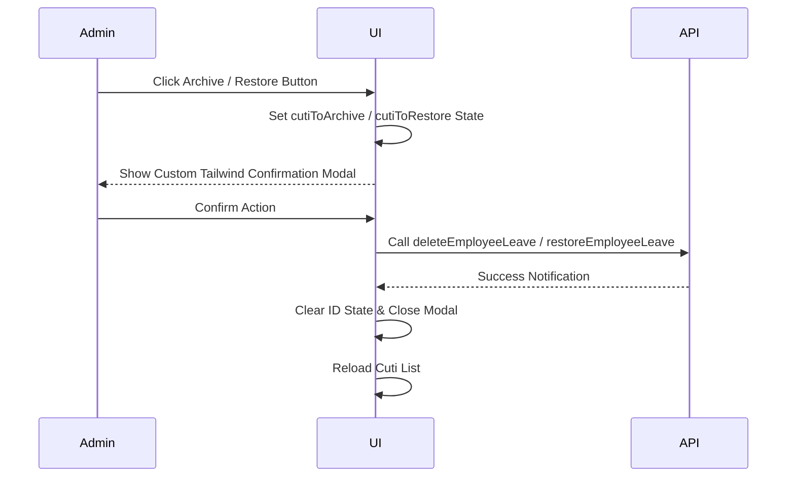

# Phase 7: CMS Admin UI for Cuti Archiving - Research
Researched: 2026-07-07
Domain: Frontend CMS UI & API client
Confidence: HIGH

## User Constraints (from CONTEXT.md)

### Locked Decisions
- **D-01:** Implement a sub-tabs layout with two horizontal button tabs ("Cuti Aktif" and "Cuti Terarsip") in the panel header of the "Daftar Cuti Terdaftar" card. This keeps the filter contextual.
- **D-02:** Change the "Hapus" button/action in the active leave list to "Arsipkan" with an archive icon (`Archive` from `lucide-react`) and trigger a confirmation dialog.
- **D-03:** Add a "Pulihkan" (Restore) button with a restore/reload icon (`RotateCcw` or `RefreshCw` from `lucide-react`) for items in the "Cuti Terarsip" list.
- **D-04:** Use the updated API client helper `deleteLeaveItem` (or alias it with `deleteEmployeeLeave`) and a new helper `restoreLeaveItem` to interface with the backend.
- **D-05:** Maintain a single list state and use the `filter` parameter of `fetchEmployeeLeaves` to reload the data dynamically on tab change.

### the agent's Discretion
- The exact styling details of the tabs and components (Tailwind classes, custom styling of the confirmation dialog) are left to the developer's discretion, keeping it premium and consistent with PPKASN TV aesthetics.

### Deferred Ideas
- None — discussion stayed within phase scope.

## Architectural Responsibility Map

| Capability | Primary Tier | Rationale |
|---|---|---|
| API Client Filtering & Restore | Client API Helper (`src/api.ts`) | Adds filter parameter support to `fetchEmployeeLeaves` and new `restoreEmployeeLeave` endpoint. |
| Sub-tabs Switcher UI | Client Component (`CmsDashboard.tsx`) | Renders tabs, controls active tab state (`cutiFilter`), and triggers re-fetch. |
| Custom Confirmation Modals | Client Component (`CmsDashboard.tsx`) | Provides custom modal overlays for Archive and Restore actions. |
| Conditional Action Rendering | Client Component (`CmsDashboard.tsx`) | Displays "Arsipkan" button for active leaves and "Pulihkan" for archived leaves. |

## Summary

This phase implements the admin-facing frontend user interface for employee leave archiving. The core requirement is to replace hard deletes with soft-deletes (archiving), filter active vs. archived records using horizontal tabs, and support restoring archived records, all using premium styled custom modals.

## Standard Stack

| Library | Version | Purpose | Why Standard |
|---|---|---|---|
| React | `^18.2.0` | UI Component Framework | Core project library |
| Tailwind CSS | `^3.x` | CSS Styling | Project styling solution |
| Lucide React | `^0.x` | UI Icons | Project standard icons pack |

### Setup and Configuration Commands

- **Navigate to the frontend directory:**
  ```bash
  cd frontend-display
  ```
- **Build the frontend application:**
  ```bash
  C:\Users\yudhiar\.bun\bin\bun run build
  ```
- **Run Jest test suite:**
  ```bash
  C:\Users\yudhiar\.bun\bin\bun test -- --watchAll=false
  ```

## Architecture Patterns

### Component State Flow

```mermaid
graph TD
    A[CmsDashboard Component] --> B[cutiFilter State: 'active' | 'archived']
    A --> C[cutiList State: LeaveItem[]]
    B -->|changes| D[loadCutiData]
    D -->|calls| E[fetchEmployeeLeaves with filter]
    E -->|updates| C
```

### Action Confirmation Modal Flow



## Don't Hand-Roll

- Avoid hand-rolling native browser confirms (`window.confirm`) where possible, as the user requested a custom Tailwind Modal for a premium corporate TV look and feel.

## Common Pitfalls

- **Pitfall 1: Missing mock functions in unit tests**
  - *Why:* The tests mock the whole API module. Adding new imports or calls to `deleteEmployeeLeave`/`restoreEmployeeLeave` in `CmsDashboard` will throw errors if they are not defined in the jest mock declaration block.
  - *Avoid:* Update `CmsDashboardResponsive.test.tsx` and `CmsDashboardSidebar.test.tsx`'s jest mock blocks to explicitly define these functions.

- **Pitfall 2: Confusing active tab with sub-tab filter**
  - *Why:* `activeTab` controls whether "Kelola Cuti" or "Agenda" is shown. `cutiFilter` controls whether "Cuti Aktif" or "Cuti Terarsip" list is shown inside "Kelola Cuti".
  - *Avoid:* Keep these states independent, and make sure `cutiFilter` only affects the data loaded when `activeTab === 'cuti'` or `activeTab === 'dashboard'`.

## Code Examples

### 1. Updated fetchEmployeeLeaves and New restoreEmployeeLeave
```typescript
export async function fetchEmployeeLeaves(filter?: "active" | "archived" | "all") {
  const url = filter ? `${API_BASE}/agenda/cuti?filter=${filter}` : `${API_BASE}/agenda/cuti`;
  const res = await fetch(url, {
    headers: getHeaders(),
  });
  if (!res.ok) throw new Error("Failed to fetch employee leaves");
  return res.json();
}

export async function restoreEmployeeLeave(id: string) {
  const res = await fetch(`${API_BASE}/agenda/cuti/${id}/restore`, {
    method: "POST",
    headers: getHeaders(),
  });
  if (!res.ok) throw new Error("Failed to restore employee leave");
  return res.json();
}

export const deleteLeaveItem = deleteEmployeeLeave;
export const restoreLeaveItem = restoreEmployeeLeave;
```

### 2. Custom Tailwind Modal Design
```tsx
{cutiToArchive && (
  <div className="fixed inset-0 z-[1000] flex items-center justify-center p-4 bg-slate-900/60 backdrop-blur-sm">
    <div className="bg-white rounded-3xl p-6 max-w-md w-full shadow-2xl border border-slate-100 flex flex-col gap-4">
      <div className="w-12 h-12 bg-amber-50 rounded-2xl flex items-center justify-center text-amber-600">
        <Archive size={24} />
      </div>
      <div>
        <h4 className="font-headline font-black text-slate-800 text-lg">Arsipkan Catatan Cuti</h4>
        <p className="font-body text-slate-500 text-sm mt-1">
          Apakah Anda yakin ingin mengarsipkan catatan cuti ini? Data akan dipindahkan ke tab "Cuti Terarsip" dan disembunyikan dari tampilan TV.
        </p>
      </div>
      <div className="flex gap-3 justify-end mt-2">
        <button
          type="button"
          onClick={() => setCutiToArchive(null)}
          className="px-4 py-2.5 rounded-xl border border-slate-200 font-headline font-bold text-slate-600 text-xs hover:bg-slate-50 transition-colors"
        >
          Batal
        </button>
        <button
          type="button"
          onClick={confirmArchiveCuti}
          className="px-4 py-2.5 rounded-xl bg-amber-600 text-white font-headline font-bold text-xs hover:bg-amber-700 transition-colors"
        >
          Ya, Arsipkan
        </button>
      </div>
    </div>
  </div>
)}
```

## Sources
- **Project Context files:** [07-CONTEXT.md](file:///C:/Users/yudhiar/Downloads/oprek/Dev/tv/.planning/phases/07-cms-admin-ui-for-cuti-archiving/07-CONTEXT.md), [REQUIREMENTS.md](file:///C:/Users/yudhiar/Downloads/oprek/Dev/tv/.planning/REQUIREMENTS.md), [ROADMAP.md](file:///C:/Users/yudhiar/Downloads/oprek/Dev/tv/.planning/ROADMAP.md)
- **Frontend Source Files:** [api.ts](file:///C:/Users/yudhiar/Downloads/oprek/Dev/tv/frontend-display/src/api.ts), [CmsDashboard.tsx](file:///C:/Users/yudhiar/Downloads/oprek/Dev/tv/frontend-display/src/components/CmsDashboard.tsx)
